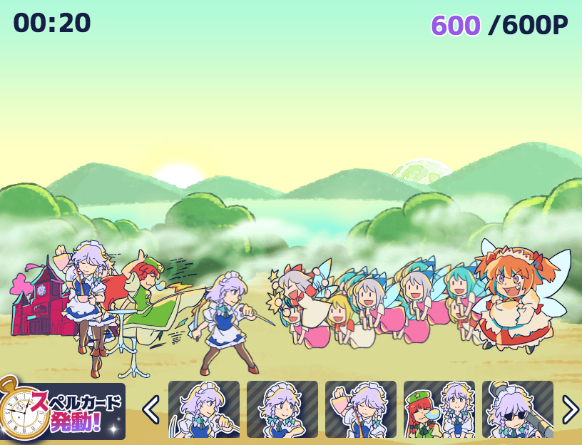
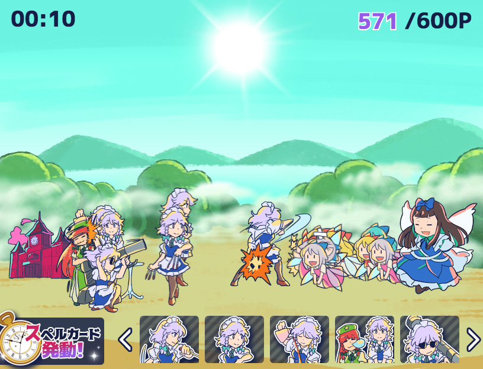
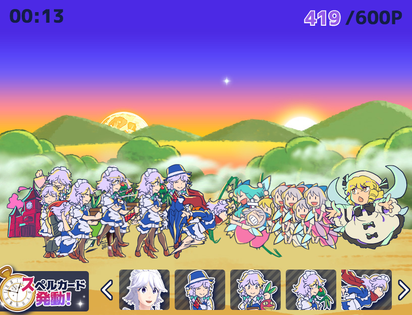

# SakuyaWars


SakuyaWars is a HTML5 Tower Defense game for browser, mobile, and PC platforms.

# Demo
[Demo](http://sairoutine.github.io/SakuyaWars/public/)

# Screenshot






# How to build
To run in your local PC:
```
$ npm install
$ npm run watch
```
And it'll be available at http://localhost:3000/

To build a distribution:
```
$ npm run build
```
This will create `main.min.js`.

To build with Electron:
```
$ npm run build:win
$ npm run build:mac
```
